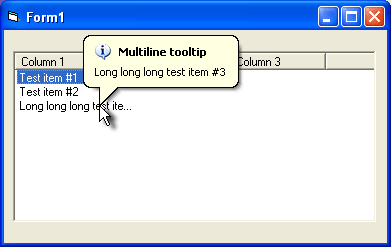



## Adding multiline balloon tooltips to ListView items

### Description

The attached code demonstrates a technique you can use to create multiline balloon tooltips for ListView items.

The code is based on the following simple idea. In the MouseMove event you need to check the index of the item under the mouse pointer, and if this item is changed, you simply redefine the text of the tooltip attached to the ListView control. Notice that you should destroy the tooltip if there is no any item under the mouse pointer.

To determine the index of the list-view item under the mouse pointer, we send the LVM_HITTEST message to the ListView control. The SendMessage function you should use to send this message returns the index of the item at the specified position, if any, or -1 otherwise. Before you send the message, populate the pt field of an instance of the LVHITTESTINFO structure with the coordinates of the mouse pointer (you pass the reference to this structure as the value of the lParam parameter in SendMessage). You can use for this purpose the X and Y parameters of the MouseMove event of the control, but draw attention at the fact that these parameters can be measured in twips and you need to convert them in pixels.

This simple idea can be used to create such tooltips for ListBox items, any grid control items and so on. For instance, we use this technique in extra samples for iGrid ActiveX Control we produce (this is an editable replacement for ListView and FlexGrid – visit www.10Tec.com for more info).
 
### More Info
 

             |
---                |---
**Submitted On**   |2003-04-19 10:09:52
**By**             |[10Tec Company](https://github.com/Planet-Source-Code/PSCIndex/blob/master/ByAuthor/10tec-company.md)
**Level**          |Intermediate
**User Rating**    |4.8 (91 globes from 19 users)
**Compatibility**  |VB 4\.0 \(32\-bit\), VB 5\.0, VB 6\.0
**Category**       |[Custom Controls/ Forms/  Menus](https://github.com/Planet-Source-Code/PSCIndex/blob/master/ByCategory/custom-controls-forms-menus__1-4.md)
**World**          |[Visual Basic](https://github.com/Planet-Source-Code/PSCIndex/blob/master/ByWorld/visual-basic.md)
**Archive File**   |[Adding\_mul1612557102003\.zip](https://github.com/Planet-Source-Code/10tec-company-adding-multiline-balloon-tooltips-to-listview-items__1-46800/archive/master.zip)

